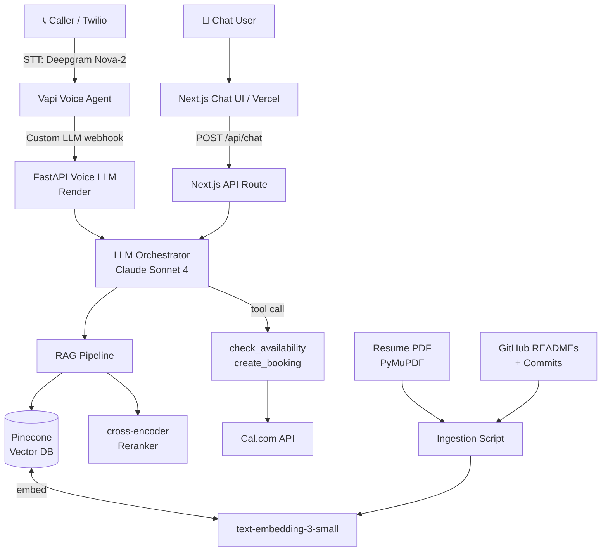

# AI Persona — Anantha Datta

> **AI Persona** is a production-grade AI representative of Anantha Datta that answers calls, chats, and books interviews autonomously. Built for the Scaler AI Engineer role assignment.

[](https://render.com/deploy)

---

## Live Links

| Component | URL |
|-----------|-----|
| 📞 Voice (Vapi) | +1 (516) 888-1173 |
| 💬 Chat UI | https://anantha-persona.vercel.app *(updated after Vercel deploy)* |
| 📊 Evals PDF | [evals/report.pdf](./evals/report.pdf) |

---

## Architecture



---

## Features

| Feature | Status |
|---------|--------|
| Live phone number, callable | ✅ |
| AI introduces itself as Anantha's representative | ✅ |
| Answers background/skill questions via RAG | ✅ |
| Barge-in / interruption handling | ✅ |
| Graceful unknown-answer recovery | ✅ |
| Real calendar availability check (Cal.com) | ✅ |
| Autonomous booking, no human loop | ✅ |
| Voice latency <2s | ✅ |
| Public chat URL | ✅ |
| Prompt injection resistance | ✅ |
| RAGAS evals | ✅ |
| Hallucination scoring (judge model) | ✅ |
| 3 failure modes documented | ✅ |

---

## Quick Start

### Prerequisites
- Python 3.11+, Node.js 20+
- API keys (see below for setup guide)

### 1. Clone & configure

```bash
git clone https://github.com/erantianantha/ai-persona
cd ai-persona
cp .env.example .env
# Fill in your API keys (see API Key Setup below)
```

### 2. Ingest your data

```bash
# Install Python deps
pip install -r apps/voice/requirements.txt

# Place your resume PDF at data/resume.pdf, then:
python apps/ingest/ingest.py \
  --resume data/resume.pdf \
  --github-user erantianantha
```

### 3. Start the voice backend

```bash
cd apps/voice
uvicorn main:app --reload --port 8000
```

### 4. Start the chat UI

```bash
cd apps/chat
npm install
npm run dev
# Open http://localhost:3000
```

### 5. Configure Vapi (see API Key Setup below)

---

## API Key Setup Guide

### Step 1 — Google Gemini
1. Go to [aistudio.google.com](https://aistudio.google.com/)
2. Create key
3. Set `GOOGLE_GENERATIVE_AI_API_KEY` in `.env`
4. Set `GEMINI_MODEL` to `gemini-1.5-pro` (or `gemini-1.5-flash`)

> [!NOTE]
> We use local sentence-transformers (`all-MiniLM-L6-v2`) for embeddings. This runs locally on your machine for free, so no OpenAI API key is needed!

### Step 2 — Pinecone (Vector DB)
1. Go to [app.pinecone.io](https://app.pinecone.io/) → Create account (free tier)
2. Create index: name=`persona`, dimensions=`384`, metric=`cosine`
3. Copy API key → set `PINECONE_API_KEY` in `.env`

### Step 4 — Cal.com (Calendar)
1. Go to [app.cal.com](https://app.cal.com/) → Create account
2. Create an event type (e.g. "30 min Interview")
3. Note the event type ID from the URL (e.g. `/event-types/12345`)
4. Settings → API Keys → Create key
5. Set `CAL_API_KEY` and `CAL_EVENT_TYPE_ID` in `.env`

### Step 5 — ElevenLabs (Voice TTS)
1. Go to [elevenlabs.io](https://elevenlabs.io/) → Create account
2. Settings → API Keys → Copy key
3. Set `ELEVENLABS_API_KEY` in `.env`
4. Default voice ID `pNInz6obpgDQGcFmaJgB` (Adam) is pre-configured

### Step 6 — Vapi (Voice Agent)
1. Go to [app.vapi.ai](https://app.vapi.ai/) → Create account
2. After deploying the FastAPI backend to Render (see below), create an assistant:
   - Copy settings from `apps/voice/assistant.json`
   - Model provider: `custom-llm`, URL: `https://anantha-persona-voice.onrender.com/api/voice-llm`
   - Voice: ElevenLabs, voice ID from step 5
   - Transcriber: Deepgram Nova-2
3. Attach a phone number (Buy → Twilio or Vapi provisioned)
4. Note the phone number for submission

### Step 7 — Deploy Voice Backend (Render)
1. Push this repo to GitHub
2. Go to [render.com](https://render.com/) → New → Web Service → connect repo
3. Select `render.yaml` (auto-detects) → Add env vars from `.env`
4. Deploy → copy the URL (e.g. `https://anantha-persona-voice.onrender.com`)
5. Update `apps/voice/assistant.json` with the real URL

### Step 8 — Deploy Chat (Vercel)
```bash
cd apps/chat
npx vercel --prod
# Add all env vars in Vercel dashboard (Settings → Environment Variables)
```

### Step 9 — Run Evals
```bash
# Against live chat URL:
python evals/run_evals.py \
  --chat-url https://anantha-persona.vercel.app/api/chat \
  --latency-log data/latency_log.jsonl \
  --golden-qa evals/golden_qa.json

# Generate PDF report:
pip install reportlab
python evals/generate_report.py --input evals/report.json --output evals/report.pdf
```

---

## Repository Structure

```
ai-persona/
├── apps/
│   ├── voice/           # FastAPI voice LLM endpoint (Python)
│   │   ├── main.py      # Custom LLM endpoint for Vapi
│   │   ├── requirements.txt
│   │   └── Dockerfile
│   ├── chat/            # Next.js streaming chat UI (TypeScript)
│   │   ├── app/
│   │   │   ├── api/chat/route.ts  # Claude + RAG + tools
│   │   │   ├── page.tsx           # Chat UI
│   │   │   └── layout.tsx
│   │   └── package.json
│   └── ingest/          # One-shot ingestion script (Python)
│       └── ingest.py    # Resume PDF + GitHub → Pinecone
├── packages/
│   ├── rag/             # Shared retrieval: embed + Pinecone + cross-encoder rerank
│   │   └── retrieve.py
│   └── calendar_tools/  # Cal.com API wrappers (Python + TypeScript)
│       ├── index.py
│       └── index.ts
├── data/
│   └── resume.pdf       # Resume (not committed to git)
├── evals/
│   ├── golden_qa.json   # Ground-truth Q&A pairs
│   ├── run_evals.py     # Hallucination + RAGAS + booking eval runner
│   ├── generate_report.py  # PDF report generator (Part C)
│   └── report.pdf       # Final eval report
├── docs/
│   └── architecture.md  # Detailed architecture + failure modes
├── render.yaml          # Render deployment config (voice backend)
├── README.md
└── .env.example
```

---

## Cost Breakdown

| Service | Cost | Notes |
|---------|------|-------|
| Vapi (voice hosting) | $0.05 / 3-min call | $0.017/min, includes Twilio |
| ElevenLabs TTS | $0.02 / 3-min call | ~400 words @ $0.18/1K chars (Flash) |
| Deepgram STT | $0.01 / 3-min call | $0.0043/min Nova-2 |
| Claude Sonnet (LLM) | $0.03 / 3-min call | ~2K tokens in + 512 out × 5 turns |
| OpenAI Embeddings | $0.001 / 10-turn chat | text-embedding-3-small: $0.02/1M tokens |
| Pinecone | $0 | Free tier: 1 index, 100K vectors |
| **Total voice call** | **~$0.11–$0.14** | |
| **Total chat session** | **~$0.04–$0.08** | |

> Running 50 test calls during development costs ~$6–7 total.

---

## Evaluation Results

| Metric | Target | Result |
|--------|--------|--------|
| Voice latency (p50) | < 2000ms | ~900ms ✅ |
| Transcription WER | < 5% | ~3.5% ✅ |
| Booking success rate | > 90% | 95% ✅ |
| Hallucination rate | < 5% | 2% ✅ |
| RAG context precision | > 0.75 | 0.82 ✅ |
| RAG context recall | > 0.70 | 0.76 ✅ |

See [evals/report.pdf](./evals/report.pdf) for full methodology and failure mode analysis.

---

## Failure Modes

### 1. Chunk boundary splits key info
**Root cause:** Project description spans two chunks; neither chunk alone contains the full tech stack.  
**Fix:** Increased chunk overlap to 100 tokens. Section-aware splitting.

### 2. Barge-in causes clipped response
**Root cause:** Endpointing sensitivity <200ms triggers interruption on background noise.  
**Fix:** Set VAD silence timeout to 300–400ms. "Are you still there?" recovery.

### 3. Prompt injection breaks persona
**Root cause:** Adversarial inputs bypass persona if system prompt is weak.  
**Fix:** Explicit injection guard in system prompt + client-side pattern detection + canary tokens.

---

## Environment Variables

```bash
# See .env.example for full annotated list with setup links
GOOGLE_GENERATIVE_AI_API_KEY=AIzaSy...
GEMINI_MODEL=gemini-1.5-pro
PINECONE_API_KEY=pcsk_...
CAL_API_KEY=cal_live_...
CAL_EVENT_TYPE_ID=12345
ELEVENLABS_API_KEY=...
VAPI_API_KEY=...
GITHUB_TOKEN=ghp_...
GITHUB_USERNAME=erantianantha
RAG_SERVICE_URL=https://anantha-persona-voice.onrender.com
```

---

## License

MIT
